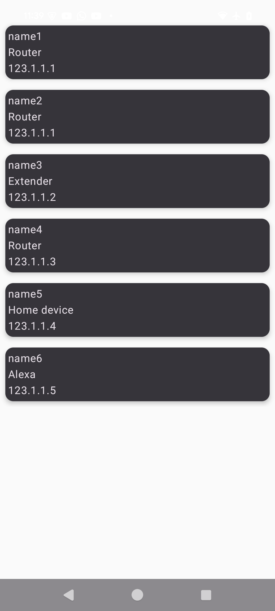

# Dependecy added: 
# Hilt
hilt-android = { module = "com.google.dagger:hilt-android", version.ref = "hilt" }
hilt-compiler = { module = "com.google.dagger:hilt-compiler", version.ref = "hilt" }

# Retrofit + Gson
retrofit = { module = "com.squareup.retrofit2:retrofit", version.ref = "retrofit" }
converter-gson = { module = "com.squareup.retrofit2:converter-gson", version.ref = "retrofit" }
gson = { module = "com.google.code.gson:gson", version.ref = "gson" }

